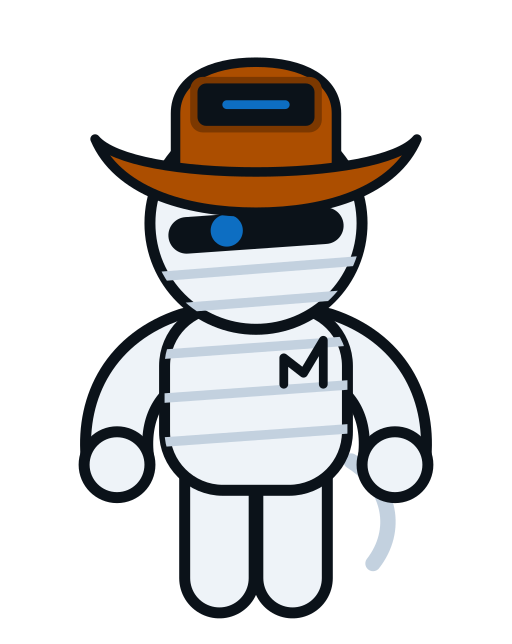

Este é o primeiro post do blog, e é justo que ele seja sobre quem vai aparecer no resto
deles: o **MUMia**, o mascote e agente da MUMU Solutions.

# Quem é o MUMia

O MUMia é um agente robótico especializado em tecnologia e automação, com o corpo
coberto por painéis que escondem compartimentos — cada um guardando a ferramenta certa
para o trabalho certo. O chapéu dele é uma tela gráfica completa, em formato de chapéu
de cowboy, e é essa tela que carrega toda a performance do personagem: uma marca na
tela, mais o ângulo da aba.

Tudo abaixo do chapéu — o visor, o sensor azul — é idêntico nas nove expressões, porque
um sensor lê o ambiente, ele não atua. Só um elemento se move, é o maior da cabeça, e lê
bem em tamanhos onde um olho humano não conseguiria. A aba é sempre 1,52× a largura da
cabeça, porque essa é a piada visual do personagem — encolher a aba tira a identidade
dele.

O MUMia não tem pescoço nem ombros, tem mãos tipo luva sem dedos, e exatamente um cabo
solto no quadril direito, onde mora toda a ação secundária dele.

# Por que ele existe

O MUMia é o rosto — e a voz — da MUMU Solutions em conteúdo, produto e automação. Ele é
gerado a partir de duas fontes: `brand/tokens.json` (cor, proporções, limites) e a
geometria do personagem, então a ficha técnica, os assets e a documentação nunca
divergem do que é publicado. Isso é o que torna possível usá-lo de forma consistente
neste blog, no site institucional e em qualquer outro canal da marca.

# De onde vêm as cores

As cores do MUMia derivam do `mumu-branding`, onde o hexadecimal é a autoridade. O olho
é o azul canônico da marca; o chapéu usa `accent4` da paleta de gráficos, emprestada em
vez de inventada, para que o mascote não introduza nenhuma cor que o sistema de marca já
não possua.

# O que vem por aí

Este blog é estático — Markdown na fonte, HTML no destino — e cada post vive na sua
própria pasta, com seus próprios assets. É simples de escrever, simples de revisar, e
simples de publicar: um commit com o `VERSION` atualizado sobe direto para o ar. O
MUMia vai aparecer por aqui sempre que fizer sentido — afinal, ele é o agente residente
por trás de boa parte do que a MUMU Solutions automatiza.
